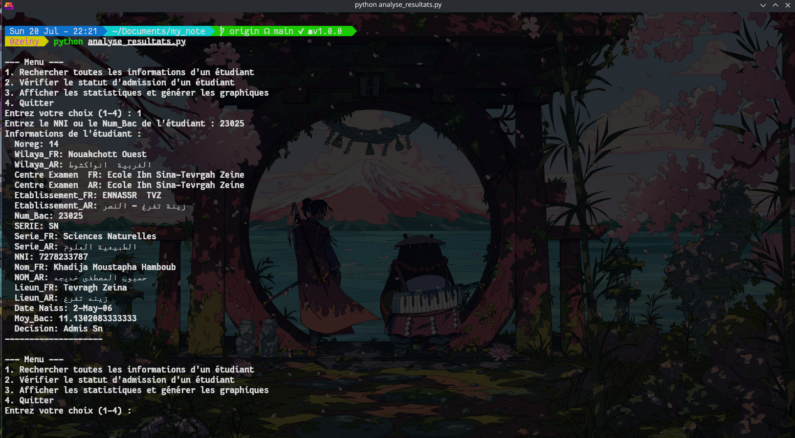
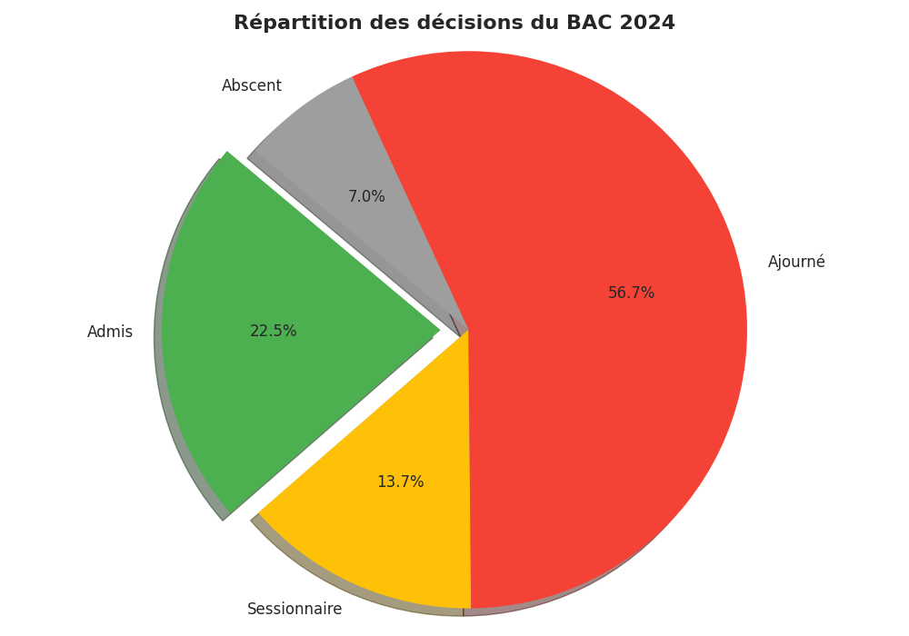
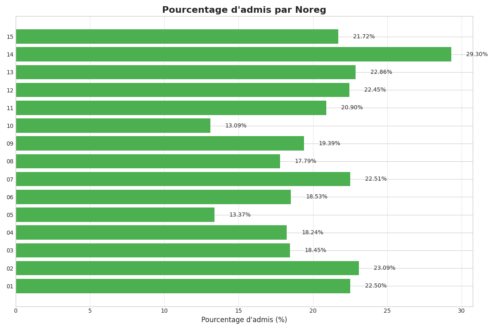
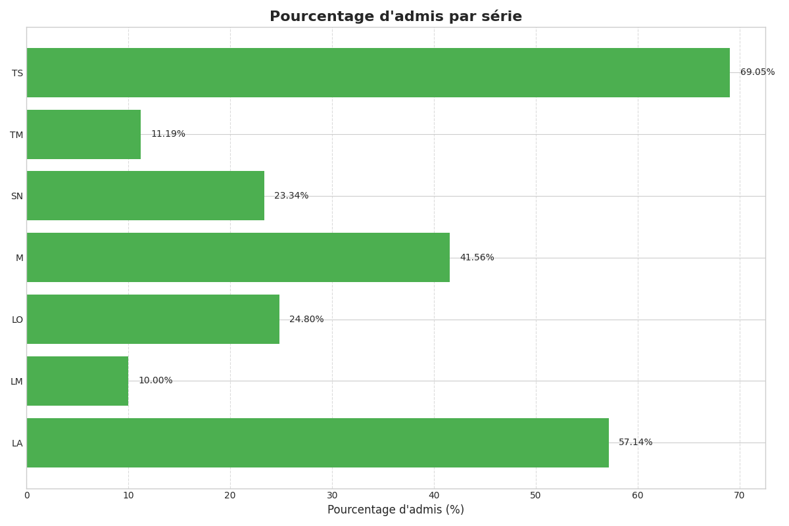
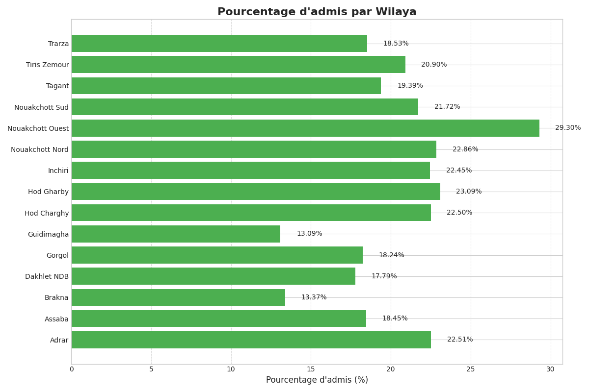

# Analyse des Résultats du BAC

Ce projet fournit un ensemble de scripts Python pour analyser les résultats du BAC à partir d'un fichier CSV.

## Fonctionnalités

- **Recherche d'étudiant** : Recherchez les informations complètes d'un étudiant par son Numéro National d'Identité (NNI) ou son numéro de BAC.
- **Vérification du statut** : Vérifiez rapidement si un étudiant est admis, en session de rattrapage, etc., ainsi que sa moyenne.
- **Statistiques détaillées** : Calculez et affichez les pourcentages de réussite globaux, par série, par Wilaya et par Noreg.
- **Visualisation graphique** : Générez des graphiques clairs (circulaires et à barres) pour visualiser les statistiques. Les graphiques sont sauvegardés dans le dossier `images/`.

## Prérequis

- Python 3

## Installation

1.  Assurez-vous que Python 3 est installé sur votre système.
2.  Installez les dépendances nécessaires en exécutant la commande suivante :

    ```bash
    pip install -r requirements.txt
    ```

## Utilisation

1.  Placez le fichier `RESULTATS_BAC_2024_SESSION_NORMALE.csv` dans le même dossier que le script.
2.  Exécutez le script principal :

    ```bash
    python3 analyse_resultats.py
    ```
3.  Un menu interactif vous guidera à travers les différentes fonctionnalités.

## Fichiers Générés

Lorsque vous utilisez la fonctionnalité de statistiques, les graphiques suivants sont générés et sauvegardés dans le dossier `images/` :

- `statistiques_decisions.png`
- `statistiques_series.png`
- `statistiques_wilayas.png`
- `statistiques_noregs.png`

## Captures d'écran

### Recherche Détaillée



### Statut d'Admission


## Graphiques Statistiques

### Statistiques par Décision



### Statistiques par Noreg



### Statistiques par Série



### Statistiques par Wilaya

